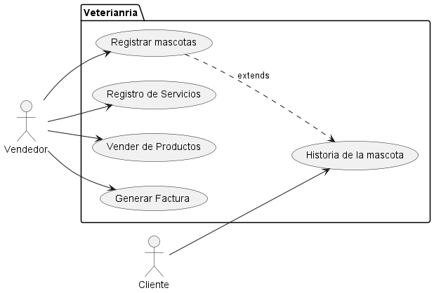

Los casos de uso en UML (Unified Modeling Language) se utilizan para modelar y documentar los requisitos funcionales de un sistema. Representan las interacciones entre los actores (usuarios u otros sistemas) y el sistema en desarrollo, describiendo cómo los actores logran un objetivo específico mediante el uso del sistema.

Son útiles para:

Definir los requisitos funcionales de manera clara y comprensible.
Comunicar las expectativas entre los desarrolladores, analistas y clientes.
Identificar los actores y sus interacciones con el sistema.
Servir como base para el diseño, desarrollo y pruebas del sistema.
Un diagrama de casos de uso es una herramienta visual que ayuda a representar estas interacciones de manera sencilla y efectiva.

